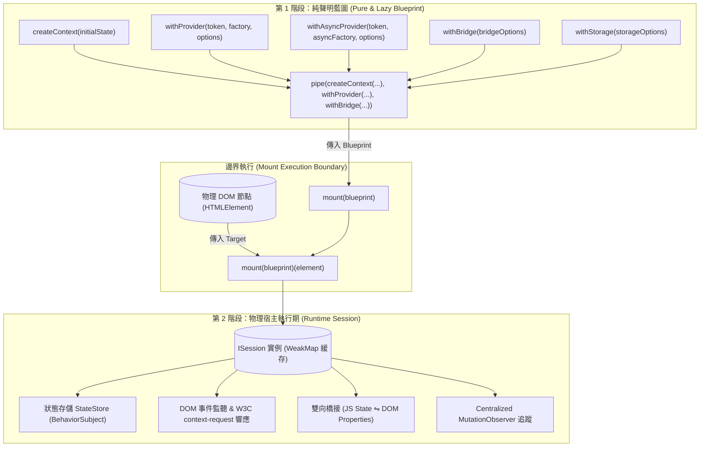
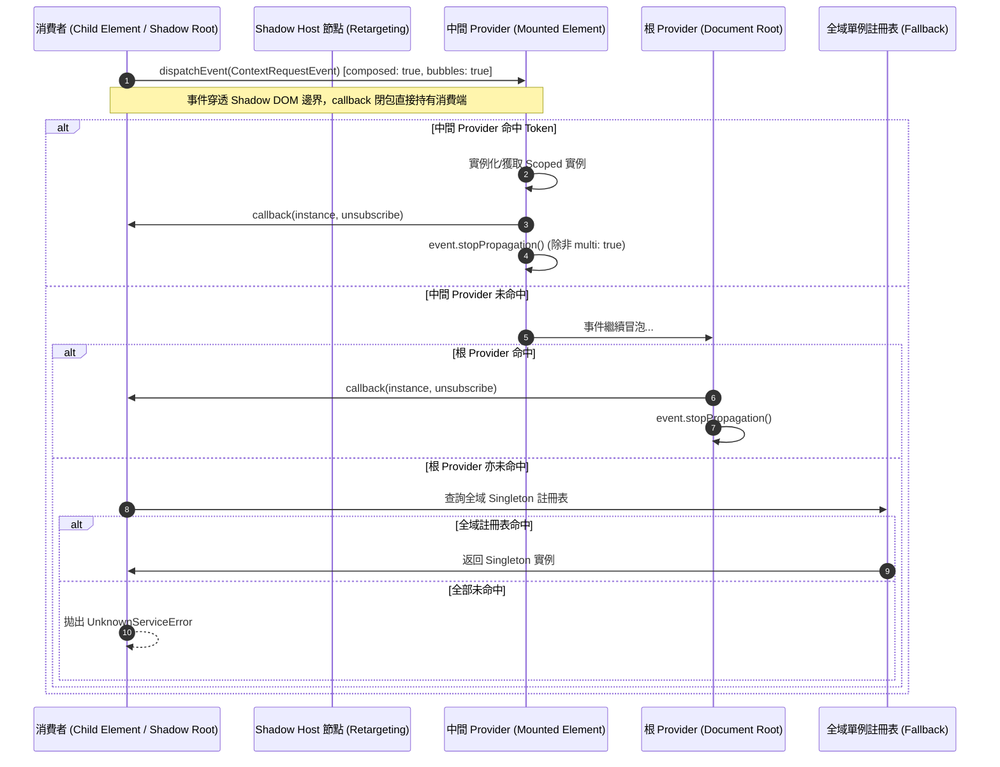
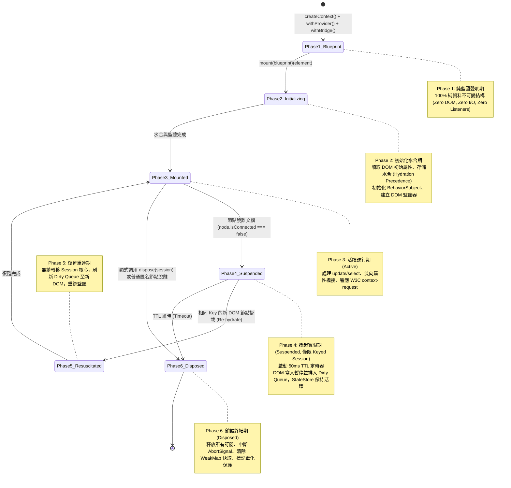
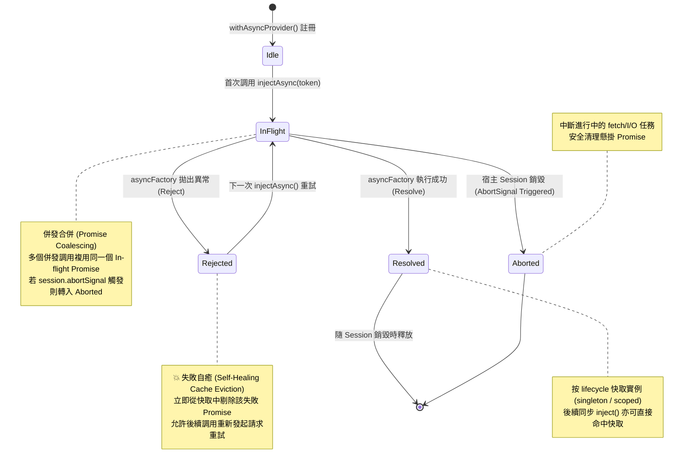
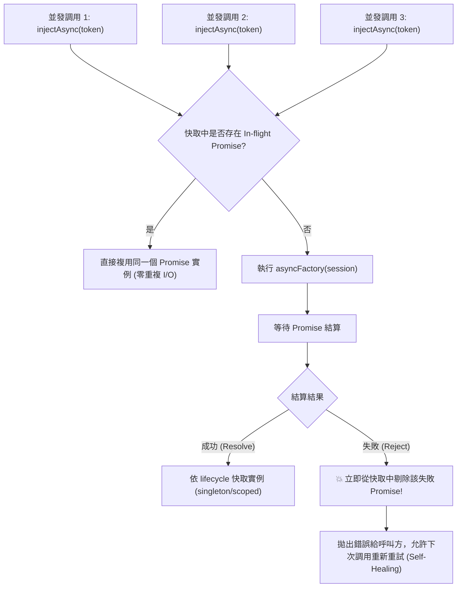
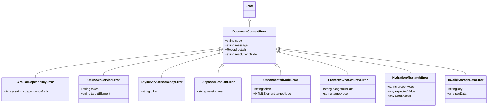

# 設計架構與技術白皮書 (DESIGN.md)

本文件為 `@sandlada/document-context` 的核心設計架構、技術白皮書與邊界規格說明書。本庫是一個專為現代瀏覽器設計、以 **`HTMLElement` / DOM 物理節點為宿主** 的「函式優先（Function-first）」依賴注入（IoC）與雙向響應式狀態管理庫。

> **標準優先原則 (Standards-First Invariant)**:
> 1. **W3C 規範優先**：嚴格遵循 W3C DOM Living Standard、W3C Community Context Protocol、Web Components Lifecycle、HTML Form-Associated Custom Elements (FACE) 與 DOM Event Flow 規範。
> 2. **行業標準優先**：嚴格遵循 TC39 ECMAScript 規範（包含 Explicit Resource Management `Symbol.dispose` / `Symbol.asyncDispose`、Signals Proposal 互操作、Decorators Stage 3）、RxJS `Subscribable` / `Observable` 協議、OWASP DOM XSS 與 Prototype Pollution 安全防護標準。
> 3. **無副作用純藍圖**：聲明期（Phase 1）100% 純記憶體不可變結構；執行期（Phase 2）嚴格受限於物理 DOM 邊界。

---

## 目錄 (Table of Contents)

1. [核心定位與設計哲學 (Core Philosophy)](#1-核心定位與設計哲學-core-philosophy)
2. [深度技術對比矩陣 (Architecture Comparison)](#2-深度技術對比矩陣-architecture-comparison)
3. [目標應用場景 (Target Use Cases)](#3-目標應用場景-target-use-cases)
4. [雙階段執行架構與 FP 運算子體系 (Two-Phase FP Blueprint Architecture)](#4-雙階段執行架構與-fp-運算子體系-two-phase-fp-blueprint-architecture)
5. [W3C Context Protocol 原生作用域解析規範 (W3C Context Protocol Specification)](#5-w3c-context-protocol-原生作用域解析規範-w3c-context-protocol-specification)
6. [四維多生命周期架構與職責劃分 (Comprehensive Multi-Lifecycle Architecture)](#6-四維多生命周期架構與職責劃分-comprehensive-multi-lifecycle-architecture)
7. [雙向 DOM 屬性橋接引擎與安全防護 (Bidirectional Property Bridge Engine)](#7-雙向-dom-屬性橋接引擎與安全防護-bidirectional-property-bridge-engine)
8. [持久化存儲、跨標籤同步與水合優先級 (Persistence & Hydration Precedence)](#8-持久化存儲跨標籤同步與水合優先級-persistence--hydration-precedence)
9. [非同步依賴注入與併發控制架構 (Async DI & Concurrency Control)](#9-非同步依賴注入與併發控制架構-async-di--concurrency-control)
10. [多值集合注入與外掛管道架構 (Multi-Provider Collection Protocol)](#10-多值集合注入與外掛管道架構-multi-provider-collection-protocol)
11. [型別系統、字串 Token 與 ServiceRegistry 宣告合併 (TypeScript Type System)](#11-型別系統字串-token-與-serviceregistry-宣告合併-typescript-type-system)
12. [完整錯誤分類學與容錯防禦體系 (Error Hierarchy & Resilience)](#12-完整錯誤分類學與容錯防禦體系-error-hierarchy--resilience)
13. [架構漏洞、競爭條件與邊界極限防禦全集 (Vulnerabilities & Mitigation Matrix)](#13-架構漏洞競爭條件與邊界極限防禦全集-vulnerabilities--mitigation-matrix)
14. [演進路線圖 (Feature Roadmap)](#14-演進路線圖-feature-roadmap)

---

## 1. 核心定位與設計哲學 (Core Philosophy)

在傳統前端架構中，狀態管理與依賴注入（IoC）通常獨立於 DOM 樹，存在於純 JavaScript 堆記憶體（Heap Memory）的全局單例或虛擬容器樹中。這種設計在現代多框架混編、微前端（Micro-frontends）、Astro / Islands 架構及 Web Components 原生開發中面臨著嚴重的「打包邊界隔離」、「空間拓撲鏡像成本」與「記憶體洩漏風險」。

`@sandlada/document-context` 提出五大核心架構支柱：

```
┌────────────────────────────────────────────────────────────────────────────────────────┐
│                        @sandlada/document-context 五大架構支柱                         │
├──────────────────────────────┬─────────────────────────────────────────────────────────┤
│ 1. 空間即作用域 (Spatial)    │ DOM 樹物理嵌套 = IoC Scope 階層，無須手動維護虛擬容器樹  │
├──────────────────────────────┼─────────────────────────────────────────────────────────┤
│ 2. 零洩漏共生 (Zero-Leak)    │ 容器生命週期與 DOM 節點完全共存亡，節點脫離自動 GC 銷毀 │
├──────────────────────────────┼─────────────────────────────────────────────────────────┤
│ 3. 原子級雙向橋接 (Bridge)   │ JS 狀態 ⇋ DOM 屬性 (dataset, style, value) 實時安全映射 │
├──────────────────────────────┼─────────────────────────────────────────────────────────┤
│ 4. 原生公共契約 (Lingua)     │ 以 W3C Context Protocol 與 DOM Event 為跨技術棧通用匯流排│
├──────────────────────────────┼─────────────────────────────────────────────────────────┤
│ 5. 純函式藍圖 (FP Blueprint) │ Phase 1 純資料聲明 (Zero I/O) + Phase 2 物理邊界掛載執行│
└──────────────────────────────┴─────────────────────────────────────────────────────────┘
```

1. **空間即作用域（Physical DOM as Scope Hierarchy）**：
   瀏覽器 UI 的物理本質是樹狀幾何拓撲。依賴解析直接沿真實 DOM 樹向上冒泡與回溯，子節點天然繼承父節點的上下文與服務，徹底消除手動構建與同步虛擬 Scope 樹的負擔。
2. **零洩漏生命週期對齊（DOM Lifecycle Co-location）**：
   容器、狀態 Store 與事件監聽器的生命週期精確掛載於物理 DOM 節點。當節點自文檔樹移除時，自動啟動微任務確認、銷毀訂閱並清理資源，杜絕單頁應用（SPA）中常見的孤兒監聽器與記憶體洩漏。
3. **視圖與狀態原子級共生（Reactive Co-location & Bidirectional Bridge）**：
   DOM 節點既是服務與狀態的持有者，也是響應式資料的物理投影。內建雙向屬性橋接器（Bidirectional Bridge），提供 Dot-path 映射、型別保真轉換、微任務批處理與死循環守衛。
4. **框架無關的原生公共契約（Framework-Agnostic Lingua Franca）**：
   基於 W3C Community Context Protocol、DOM Custom Events、`HTMLElement` 與 TC39 標準構建。無論宿主內部使用 React、Vue、Svelte、Solid、Vanilla JS 還是 SSR 模板引擎，均可透過底層物理 DOM 進行無縫服務共享與狀態通訊。
5. **純函式藍圖與參數後置（Pure FP Blueprint & Data-Last Paradigm）**：
   全面摒棄帶有隱含 `this` 與副作用的物件導向容器類，採用 Curried Data-Last 函數式 API。在藍圖組裝階段零副作用，僅在 `mount(blueprint)(element)` 邊界處觸發物理 DOM 副作用。

---

## 2. 深度技術對比矩陣 (Architecture Comparison)

### 2.1 與主流依賴注入及狀態方案對比

| 維度 | 純 JS IoC (Inversify / TSyringe) | React Context / Vue Provide | Web Components (@lit/context) | 本項目 (`@sandlada/document-context`) |
| :--- | :--- | :--- | :--- | :--- |
| **依附宿主** | JS 堆記憶體 (Heap Global) | 虛擬 DOM Fiber / VNode 樹 | Custom Elements 節點 | **任意物理 DOM 節點 (`HTMLElement` / `Document`)** |
| **作用域拓撲** | 手動 `createChildContainer()` | 依賴特定框架 JSX/Template 嵌套 | 依賴 CustomElement 繼承 | **天然映射物理 DOM 樹的空間幾何嵌套** |
| **跨技術棧共享** | ❌ 受限於 JS 模組閉包與 Bundle | ❌ 無法跨框架 (React ⇋ Vue 隔離) | ⚠️ 偏向 Lit 生態 | **✅ 瀏覽器原生 DOM 匯流排，100% 跨技術棧** |
| **雙向視圖綁定** | ❌ 無（需手動撰寫大量膠水代碼） | ⚠️ 單向渲染（需受控組件回調） | ⚠️ 單向屬性傳遞 | **✅ 內建雙向屬性橋接 (Dot-path, 死循環守衛)** |
| **生命週期管理** | 手動調用 `container.unload()` | 隨虛擬組件 Unmount 銷毀 | 隨 `disconnectedCallback` 處理 | **✅ Centralized Observer 自動 GC + 寬限期復甦** |
| **編程範式** | OOP Class + 裝飾器 / 類別反射 | Hook / 宣告式組件 | Class Decorator / Controller | **✅ 純函式 Pipeline + Data-Last Curried Verbs** |
| **標準對齊** | 專有 JS 容器架構 | 專有 VDOM 協議 | W3C Community Context Protocol | **✅ 嚴格遵循 W3C Context Protocol & TC39 規範** |

---

## 3. 目標應用場景 (Target Use Cases)

1. **Astro / Islands 架構與多獨立 `<script>` 標籤**：
   在 Astro 或靜態生成的多島嶼頁面中，各個獨立島嶼組件由不同的 Bundle 打包，無法共享 JS 模組內存引用。透過宿主 DOM 節點作為公共 Context 錨點，島嶼之間可無縫共享狀態與服務。
2. **微前端（Micro-frontends）與多技術棧混編**：
   主應用為 Next.js / React，側邊欄為 Vue 3，彈窗為 Web Component，以物理 DOM 為唯一媒介共享身份驗證服務（`'auth:service'`）、全局購物車狀態與日誌追蹤。
3. **Web Components & Custom Elements 原生開發**：
   自定義元素在 `connectedCallback()` 時直接調用 `inject(token)(this)` 向上穿透 Shadow DOM 解析依賴，脫離 DOM 時自動清理資源。
4. **漸進式增強（Progressive Enhancement）與 HTMX / Turbo 應用**：
   在傳統後端渲染（Rails / Django / Laravel / Astro）頁面上，以極小運行時開銷為 HTML 節點注入交互與狀態，且在 HTMX 片段置換（Swap）或拖拽排序時具備防誤殺與自動水合能力。
5. **瀏覽器擴充功能（Web Extensions）與第三方 SDK**：
   在宿主網頁現有 DOM 上寄生注入獨立服務，在宿主節點變更時保證零記憶體洩漏與沙箱隔離。

---

## 4. 雙階段執行架構與 FP 運算子體系 (Two-Phase FP Blueprint Architecture)

為了實現極致的可測試性、高內聚、模組可分塊（Tree-shaking）與副作用受控，系統將整個生命週期嚴格劃分為 **Phase 1（純藍圖聲明）** 與 **Phase 2（掛載執行邊界）**。



### 4.1 核心介面定義 (Core Interface Contracts)

```ts
import type { Observable, Subscription } from 'rxjs'

// 品牌化 Token
declare const ServiceTokenBrand: unique symbol
export interface ServiceToken<T, Name extends string = string> {
    readonly [ServiceTokenBrand]: true
    readonly name: Name
    readonly __type?: T
}

// 服務生命週期
export type ServiceLifecycle = 'singleton' | 'scoped' | 'transient'

// 服務註冊記錄 (內部純資料結構)
export interface IServiceRegistration<T = unknown> {
    readonly token: string | ServiceToken<T>
    readonly factory: (session: ISession<any>) => T | Promise<T>
    readonly lifecycle: ServiceLifecycle
    readonly isAsync: boolean
    readonly multi?: boolean
}

// 橋接配置
export interface IBridgePropertyRule<S = any> {
    readonly target: string // Dot-path: 如 'dataset.count', 'style.color', 'value', 'aria-expanded'
    readonly parse?: (domValue: string) => any
    readonly transform?: (stateValue: any) => string | boolean | number | null
    readonly event?: string // 自訂觸發事件，預設為 'input' | 'change'
}

export interface IBridgeOptions<S = any> {
    readonly properties: {
        readonly [K in keyof S]?: string | IBridgePropertyRule<S>
    }
    readonly events?: readonly string[] // 預設 ['input', 'change']
    readonly batch?: boolean // 預設 true (微任務批處理)
    readonly conflict?: 'lastWriteWins' | 'statePrecedence' | 'domPrecedence'
    readonly activeElementGuard?: boolean // 預設 true (防止 input 焦點輸入時光標跳躍)
}

// 存儲與水合配置
export type HydrationStrategy = 'storageFirst' | 'domFirst' | 'blueprintFirst' | 'merge'

export interface IStorageOptions<S = any> {
    readonly adapter: 'localStorage' | 'sessionStorage' | IStorageAdapter<S> | IAsyncStorageAdapter<S>
    readonly key: string
    readonly hydrationStrategy?: HydrationStrategy // 預設 'storageFirst'
    readonly crossTabSync?: boolean // 預設 true (監聽 storage 事件)
    readonly version?: number // 存儲版本號
    readonly migrate?: (persistedState: unknown, oldVersion: number) => Partial<S>
}

// 生命週期鉤子配置
export type HookCleanup = void | (() => void)

export interface ILifecycleHooks<S extends Record<PropertyKey, unknown> = Record<PropertyKey, unknown>, Services = {}> {
    readonly mount?: (session: ISession<S, Services>) => HookCleanup | Promise<HookCleanup>
    readonly dispose?: (session: ISession<S, Services>) => void | Promise<void>
    readonly suspend?: (session: ISession<S, Services>) => void
    readonly resuscitate?: (session: ISession<S, Services>, newTarget: HTMLElement) => void
    readonly adopt?: (session: ISession<S, Services>, newDocument: Document) => void
}

export type LifecycleEventName = keyof ILifecycleHooks

export interface ILifecycleHookRegistration<S extends Record<PropertyKey, unknown> = Record<PropertyKey, unknown>, Services = {}> {
    readonly event: LifecycleEventName
    readonly handler: Function
}

// 藍圖介面 (100% 純不可變結構，結構共享)
export interface IContextBlueprint<S extends Record<PropertyKey, unknown> = Record<PropertyKey, unknown>, Services = {}> {
    readonly initialState: Readonly<S>
    readonly providers: ReadonlyMap<string | ServiceToken<any>, IServiceRegistration<any>>
    readonly bridges: ReadonlyArray<IBridgeOptions<S>>
    readonly storage?: Readonly<IStorageOptions<S>>
    readonly hooks: ReadonlyArray<ILifecycleHookRegistration<S, Services>>
}

// 執行期會話介面 (不透明句柄)
declare const SessionBrand: unique symbol
export interface ISession<S extends Record<PropertyKey, unknown> = Record<PropertyKey, unknown>, Services = {}> {
    readonly [SessionBrand]: true
    readonly target: HTMLElement
    readonly blueprint: IContextBlueprint<S, Services>
    readonly abortSignal: AbortSignal
    readonly isDisposed: boolean
    readonly [Symbol.dispose]: () => void
    readonly [Symbol.asyncDispose]: () => Promise<void>
}
```

### 4.2 純運算子藍圖組裝規範 (Pure Blueprint Operators)

所有藍圖運算子均為純函式，具備不可變性（Immutable Structural Sharing），每次呼叫均返回全新的 Blueprint 實例：

```ts
// 1. 建立藍圖種子
export function createContext<S extends Record<PropertyKey, unknown>>(
    initialState: S
): IContextBlueprint<S, {}>

// 2. 管道組裝工具 (支援 1~10+ 個運算子並精確推導累積服務型別)
export function pipe<S extends Record<PropertyKey, unknown>, S1, S2>(
    source: IContextBlueprint<S, S1>,
    op1: (bp: IContextBlueprint<S, S1>) => IContextBlueprint<S, S2>
): IContextBlueprint<S, S2>
export function pipe<S extends Record<PropertyKey, unknown>, S1, S2, S3>(
    source: IContextBlueprint<S, S1>,
    op1: (bp: IContextBlueprint<S, S1>) => IContextBlueprint<S, S2>,
    op2: (bp: IContextBlueprint<S, S2>) => IContextBlueprint<S, S3>
): IContextBlueprint<S, S3>

// 3. 服務提供者運算子 (同步)
export function withProvider<K extends string, T, S extends Record<PropertyKey, unknown>, ExistingServices>(
    token: K,
    factory: (session: ISession<S, ExistingServices>) => T,
    options?: { lifecycle?: ServiceLifecycle; multi?: false }
): (blueprint: IContextBlueprint<S, ExistingServices>) => IContextBlueprint<S, ExistingServices & Record<K, T>>

// 4. 非同步服務提供者運算子
export function withAsyncProvider<K extends string, T, S extends Record<PropertyKey, unknown>, ExistingServices>(
    token: K,
    asyncFactory: (session: ISession<S, ExistingServices>) => Promise<T>,
    options?: { lifecycle?: ServiceLifecycle; multi?: false }
): (blueprint: IContextBlueprint<S, ExistingServices>) => IContextBlueprint<S, ExistingServices & Record<K, Promise<T>>>

// 5. 雙向屬性橋接運算子
export function withBridge<S extends Record<PropertyKey, unknown>, Services>(
    options: IBridgeOptions<S>
): (blueprint: IContextBlueprint<S, Services>) => IContextBlueprint<S, Services>

// 6. 持久化存儲運算子
export function withStorage<S extends Record<PropertyKey, unknown>, Services>(
    options: IStorageOptions<S>
): (blueprint: IContextBlueprint<S, Services>) => IContextBlueprint<S, Services>

// 7. 宣告式生命週期鉤子運算子
export function withHook<
    Event extends LifecycleEventName,
    S extends Record<PropertyKey, unknown>,
    Services
>(
    event: Event,
    handler: NonNullable<ILifecycleHooks<S, Services>[Event]>
): (blueprint: IContextBlueprint<S, Services>) => IContextBlueprint<S, Services>
```

### 4.3 參數後置（Data-Last）執行期動詞規範

所有執行期動詞嚴格遵循 `verb(config)(target)` 柯里化簽名：

```ts
// 1. 物理掛載邊界
export function mount<S extends Record<PropertyKey, unknown>, Services>(
    blueprint: IContextBlueprint<S, Services>
): (element: HTMLElement) => ISession<S, Services>

// 2. 阻塞式非同步掛載 (等待非同步存儲與關鍵服務水合完成)
export function mountAsync<S extends Record<PropertyKey, unknown>, Services>(
    blueprint: IContextBlueprint<S, Services>
): (element: HTMLElement) => Promise<ISession<S, Services>>

// 3. 狀態快照讀取 (Select)
export function select<S extends Record<PropertyKey, unknown>, R>(
    selector: (state: S) => R
): <Services>(session: ISession<S, Services>) => R

// 4. 狀態更新 (Update: 支援 Partial 物件或純函數更新器；若 Session 已 Disposed 則安全 No-op 回傳 false)
export function update<S extends Record<PropertyKey, unknown>>(
    updater: Partial<S> | ((prevState: S) => Partial<S> | S)
): <Services>(session: ISession<S, Services>) => boolean

// 5. 響應式狀態訂閱 (Subscribe: 回傳解除訂閱函式)
export function subscribe<S extends Record<PropertyKey, unknown>>(
    listener: (state: S) => void
): <Services>(session: ISession<S, Services>) => () => void

// 6. 同步依賴注入 (Inject: 支援 Session 實例或任意子 DOM 節點)
export function inject<K extends keyof ServiceRegistry>(
    token: K
): (target: ISession<any, any> | HTMLElement) => ServiceRegistry[K]
export function inject<T>(
    token: ServiceToken<T>
): (target: ISession<any, any> | HTMLElement) => T
export function inject<T = unknown>(
    token: string
): (target: ISession<any, any> | HTMLElement) => T

// 7. 非同步依賴注入 (InjectAsync)
export function injectAsync<K extends keyof ServiceRegistry>(
    token: K,
    options?: { signal?: AbortSignal }
): (target: ISession<any, any> | HTMLElement) => Promise<Awaited<ServiceRegistry[K]>>
export function injectAsync<T>(
    token: ServiceToken<T>,
    options?: { signal?: AbortSignal }
): (target: ISession<any, any> | HTMLElement) => Promise<T>
export function injectAsync<T = unknown>(
    token: string,
    options?: { signal?: AbortSignal }
): (target: ISession<any, any> | HTMLElement) => Promise<T>

// 8. 多值集合注入 (InjectAll / InjectAllAsync)
export function injectAll<K extends keyof ServiceRegistry>(
    token: K,
    options?: { direction?: 'bottomUp' | 'topDown' }
): (target: ISession<any, any> | HTMLElement) => ReadonlyArray<ServiceRegistry[K]>
export function injectAll<T = unknown>(
    token: string | ServiceToken<T>,
    options?: { direction?: 'bottomUp' | 'topDown' }
): (target: ISession<any, any> | HTMLElement) => ReadonlyArray<T>

export function injectAllAsync<K extends keyof ServiceRegistry>(
    token: K,
    options?: { direction?: 'bottomUp' | 'topDown'; signal?: AbortSignal }
): (target: ISession<any, any> | HTMLElement) => Promise<ReadonlyArray<Awaited<ServiceRegistry[K]>>>
export function injectAllAsync<T = unknown>(
    token: string | ServiceToken<T>,
    options?: { direction?: 'bottomUp' | 'topDown'; signal?: AbortSignal }
): (target: ISession<any, any> | HTMLElement) => Promise<ReadonlyArray<T>>

// 9. 銷毀 (Dispose)
export function dispose<S extends Record<PropertyKey, unknown>, Services>(
    session: ISession<S, Services>
): void

// 10. 非致命錯誤流 (ReadErrorStream)
export function readErrorStream<S extends Record<PropertyKey, unknown>, Services>(
    session: ISession<S, Services>
): Observable<DocumentContextError>
```

### 4.4 宣告式生命週期鉤子與 DOM 原生事件體系 (Lifecycle Hooks & Native DOM Events)

為了讓開發者在 Vanilla JS、Astro、HTMX、多框架混編與微前端環境中無縫管理第三方命令式資源（ECharts、Three.js、Canvas、WebSocket、Web Worker），系統提供三層階梯式生命周期暴露體系：

```
[第 1 層: 宣告式藍圖運算子] ──> withHook('mount' | 'dispose' | 'suspend' | 'resuscitate' | 'adopt', callback)
[第 2 層: 原生 Web 標準媒介] ──> session.abortSignal (標準 abort 事件監聽)
[第 3 層: 物理 DOM 事件廣播] ──> element.addEventListener('context-mount' | 'context-dispose', ...)
```

#### 4.4.1 `withHook` 藍圖運算子使用範式

```ts
const chartBlueprint = pipe(
    createContext({ chartData: [10, 20, 30] }),
    
    // 1. Mount 鉤子：物理 DOM 掛載、水合完成後觸發
    withHook('mount', (session) => {
        const chart = new ECharts(session.target)
        chart.setOption({ data: select((s) => s.chartData)(session) })
        
        // 🌟 核心設計：支援回傳 Cleanup 清理閉包，在 Session 銷毀時自動調用
        return () => {
            chart.dispose()
        }
    }),

    // 2. Dispose 鉤子：Session 徹底銷毀時觸發
    withHook('dispose', (session) => {
        analytics.track('chart_unmounted', { id: session.target.id })
    }),

    // 3. Suspend / Resuscitate 鉤子：針對 Keyed Session 的 50ms 寬限復甦
    withHook('suspend', (session) => {
        // 節點暫時脫離文檔，暫停高耗能動畫渲染
        pauseAnimationLoop()
    }),
    withHook('resuscitate', (session, newTarget) => {
        // 新節點重新掛載，無縫重啟渲染並轉移 Canvas 句柄
        resumeAnimationLoop(newTarget)
    }),

    // 4. Adopt 鉤子：跨 Document 遷移 (iframe / Picture-in-Picture)
    withHook('adopt', (session, newDocument) => {
        console.log('Migrated to new document:', newDocument)
    })
)
```

#### 4.4.2 鉤子執行時序、異常隔離與 LIFO 銷毀保證 (Execution Order & Error Isolation)

1. **掛載執行順序 (FIFO)**：在 `mount(blueprint)(element)` 執行期，所有註冊的 `mount` 鉤子嚴格按照藍圖宣告的順序（FIFO）依次執行。
2. **銷毀執行順序 (LIFO)**：在 `dispose(session)` 執行期，所有 `mount` 返回的 Cleanup 清理閉包以及 `dispose` 鉤子按照**後註冊先執行（LIFO）**的反向順序執行，確保依賴關係自底向上安全釋放。
3. **異常沙箱隔離（Error Isolation Guard）**：每一個鉤子函式與清理閉包均在獨立的 `try...catch` 沙箱中執行。若某個第三方程式庫的銷毀方法拋出異常，系統自動將異常封裝推送至 `readErrorStream(session)`，**絕對不中斷剩餘清理任務與 Session 的徹底銷毀流程**，杜絕資源洩漏。

#### 4.4.3 原生 Web 標準媒介 `session.abortSignal`

`ISession` 實例自帶標準 `abortSignal: AbortSignal`。任何非同步或定時器任務無需手動註冊 `withHook`，直接傳遞 `session.abortSignal` 即可獲得自動取消與銷毀保證：

```ts
// 原生 fetch 請求隨 Session 銷毀自動級聯取消
const userBlueprint = pipe(
    createContext({ user: null }),
    withAsyncProvider('api:user', async (session) => {
        const res = await fetch('/api/user', { signal: session.abortSignal })
        return res.json()
    })
)
```

#### 4.4.4 物理 DOM 原生生命週期事件廣播 (Host Custom Events)

在物理宿主節點上分發標準 CustomEvent，允許同頁面其他無關腳本或微前端容器進行無侵入被動監聽：

| 事件名稱 | 觸發時機 | `event.detail` 攜帶資料 | 說明 |
| :--- | :--- | :--- | :--- |
| `context-mount` | Session 完成水合並進入 Mounted 態 | `{ session }` | 宿主節點掛載完成 |
| `context-dispose` | Session 調用 dispose 或 GC 徹底銷毀 | `{ sessionKey }` | 宿主節點上下文已銷毀 |
| `context-suspend` | Keyed 節點脫離文檔進入 50ms 寬限期 | `{ sessionKey, ttl: 50 }` | 宿主節點進入掛起態 |
| `context-resuscitate` | Keyed 節點在寬限期內於新 DOM 復甦 | `{ session, newTarget }` | 宿主節點完成復甦 |
| `context-adopt` | 節點被 adoptNode 遷移至新 Document | `{ newDocument }` | 跨文檔遷移完成 |


---

## 5. W3C Context Protocol 原生作用域解析規範 (W3C Context Protocol Specification)

本項目完全遵從 **W3C Web Components Community Group Context Protocol** 標準。透過原生 DOM CustomEvent 事件流與閉包回調完成父子組件解耦通訊，天然相容 Open / Closed Shadow DOM 穿透與跨框架邊界。

### 5.1 W3C 事件協議契約 (W3C Event Contract)

```ts
export const CONTEXT_REQUEST_EVENT = 'context-request'

export type ContextCallback<ValueType> = (
    value: ValueType,
    dispose?: () => void
) => void

export interface ContextRequestDetail<ContextType, ValueType> {
    readonly context: ContextType
    readonly callback: ContextCallback<ValueType>
    readonly subscribe?: boolean
    readonly multi?: boolean
}

export class ContextRequestEvent<ContextType, ValueType> extends CustomEvent<ContextRequestDetail<ContextType, ValueType>> {
    constructor(
        context: ContextType,
        callback: ContextCallback<ValueType>,
        options?: { subscribe?: boolean; multi?: boolean }
    ) {
        super(CONTEXT_REQUEST_EVENT, {
            bubbles: true,
            composed: true, // 核心：允許事件穿透 Shadow DOM 邊界！
            cancelable: true,
            detail: {
                context,
                callback,
                subscribe: options?.subscribe ?? false,
                multi: options?.multi ?? false
            }
        })
    }
}
```

### 5.2 作用域解析階層與事件冒泡機制 (Resolution Hierarchy)



### 5.3 關鍵邊界與標準防護

1. **Closed Shadow DOM 與 Event Retargeting 防禦**：
   在 `mode: 'closed'` 的 Shadow DOM 中，手動攀爬 `node.parentElement` 會在 Shadow Root 處中斷返回 `null`；且跨越邊界時瀏覽器會將 `event.target` 重定向為 Host 節點。
   * **標準防禦**：本庫嚴格禁止使用命令式 DOM 攀爬尋找 Provider，全部透過 `composed: true` 事件冒泡傳遞。Provider 回應時直接調用 `event.detail.callback(instance)`，完全無需讀取 `event.target`，在 Closed Shadow DOM 下 100% 穩定運作。
2. **未掛載節點（Unconnected Node）診斷**：
   若在 `element.isConnected === false`（如 Web Component `constructor()` 階段或未 `appendChild` 的動態節點）調用 `inject()`，事件無法冒泡。
   * **標準防禦**：`inject(token)(element)` 在執行時主動校驗 `element.isConnected`。若為 `false`，首先嘗試查詢 Global Singleton，若未命中則拋出具備詳細修復指引的 `UnconnectedNodeError`（指引開發者在 `connectedCallback()` 或掛載至文檔後調用）。
3. **跨文檔遷移（`adoptedCallback` / `document.adoptNode`）**：
   當節點被搬移至 `iframe` 或畫中畫（Picture-in-Picture）子文檔時，Session 自動感知 `adoptedCallback`，註銷舊文檔的 Centralized Observer，並重新綁定至新宿主文檔的 Observer。

### 5.4 W3C `subscribe: true` 串流上下文訂閱協議 (Streaming Context Protocol)

在 W3C Community Context Protocol 中，消費者可傳遞 `subscribe: true` 請求建立長期響應式串流連接：

```ts
// 消費端發起響應式訂閱請求
element.dispatchEvent(new ContextRequestEvent(
    'theme:mode',
    (theme, unsubscribe) => {
        applyTheme(theme)
        // 當組件銷毀或斷開連接時主動調用 unsubscribe()
    },
    { subscribe: true }
))
```

1. **Provider 串流綁定**：
   當宿主 Provider 接收到 `subscribe: true` 時，若所請求的 Context 為響應式狀態或動態服務，Provider 自動建立內部監聽器（或訂閱內部 `BehaviorSubject`），在每次狀態值變更時持續調用 `callback(nextValue, unsubscribeFn)`。
2. **零洩漏退訂機制（Unsubscribe Lifecycle）**：
   Provider 在返回的回調中提供 `unsubscribe` 閉包函式。消費端在 `disconnectedCallback` 時調用 `unsubscribe()` 即可精確中斷訂閱。
3. **宿主銷毀聯動**：
   當 Provider 自身的 Session 被銷毀（`dispose(session)`）時，自動遍歷並終止該 Provider 下分發的所有活躍串流回調，防止孤兒回調洩漏。

### 5.5 Provider 路由弱引用快取與拓撲失效算法 (Route Cache & Invalidation)

* **機制**：為避免虛擬滾動或高頻渲染時連續調用 `inject()` 造成大量的 CustomEvent 分發開銷，Consumer Session 維護一個 `WeakRef` 快取指向最近一次成功命中的 Provider Session。
* **失效條件**：透過全域 Centralized Observer 監聽 DOM 樹變更（`childList` 增刪節點）。當 Consumer 節點所在的祖先路徑發生變更時，立即標記路由快取失效，下一次 `inject()` 自動重新透過事件冒泡解析最新拓撲。

---

## 6. 四維多生命周期架構與職責劃分 (Comprehensive Multi-Lifecycle Architecture)

在傳統前端框架中，生命周期往往被粗暴地簡化為單一的「組件掛載 / 卸載」。然而，在以物理 DOM 節點為宿主的 IoC 容器與響應式系統中，單一生命周期模型會引發嚴重的架構混亂（例如：DOM 節點重排不等於狀態銷毀、全域單例不應隨局部 DOM 節點卸載、非同步請求在節點脫離時需要取消而非掛起、持久化狀態的存續週期遠長於記憶體會話）。

為此，`@sandlada/document-context` 建立正交且相互協調的**四維多生命周期架構**，每一維度擁有清晰且互不越界的職責邊界：

```
┌────────────────────────────────────────────────────────────────────────────────────────┐
│                        四維多生命周期架構 (Multi-Lifecycle Topology)                   │
├────────────────────────────────────────────────────────────────────────────────────────┤
│ 1. 物理 DOM 宿主生命周期   (Physical DOM Lifecycle: W3C Living Standard)              │
│    Unconnected ──> Connected ──> Adopted ──> Disconnected ──> GC Collected            │
├────────────────────────────────────────────────────────────────────────────────────────┤
│ 2. 會話執行期狀態機生命周期 (Session State Machine Lifecycle: Runtime Boundaries)       │
│    Phase 1: Blueprint ──> Phase 2: Initializing ──> Phase 3: Mounted ──>              │
│    Phase 4: Suspended (TTL) ──> Phase 5: Resuscitated ──> Phase 6: Disposed            │
├────────────────────────────────────────────────────────────────────────────────────────┤
│ 3. 依賴與服務解析生命周期   (Service & IoC Scope Lifecycle: Dependency Management)     │
│    Singleton ⇋ Scoped ⇋ Transient | Lazy vs Eager | In-Flight ➔ Resolved ➔ Evicted    │
├────────────────────────────────────────────────────────────────────────────────────────┤
│ 4. 狀態、橋接與存儲生命周期 (State, Bridge & Storage Lifecycle: Data Synchronization)   │
│    Blueprint Seed ──> Hydration Precedence ──> Reactive Flow ──> Txn Lock ──> Finalized│
└────────────────────────────────────────────────────────────────────────────────────────┘
```

### 6.1 第一維度：物理 DOM 宿主生命周期 (Physical DOM Lifecycle - W3C Standard)

* **核心職責**：管理底層 HTML/DOM 節點在文檔樹中的空間拓撲、物理連接狀態與跨文檔遷移。此維度 100% 遵從 W3C DOM Living Standard 與 Web Components 規範，**絕不直接介入 JavaScript 業務邏輯或狀態流轉**。

| 階段名稱 | 觸發條件與 DOM 狀態 | 核心特徵與系統行為 | 職責與防護保證 |
| :--- | :--- | :--- | :--- |
| **`Unconnected` (未掛載/構造期)** | `node.isConnected === false` (如 `document.createElement()` 或 Web Component `constructor()` 階段) | 節點已存在於 JS 堆中，但未插入任何 `Document` 或 `ShadowRoot` | 嚴禁執行 DOM 事件冒泡解析；`inject()` 主動攔截並拋出 `UnconnectedNodeError` 或回退至全域單例 |
| **`Connected` (文檔掛載連接期)** | 節點插入文檔樹，觸發 Custom Element `connectedCallback()` 或 Centralized Observer 捕獲 `childList` 插入 | 節點具備完整的祖先鏈路 (`parentElement`)，可進行標準 W3C `composed: true` 事件冒泡 | 允許執行依賴注入解析；啟動雙向屬性橋接；將未水合的 DOM 屬性納入水合決策 |
| **`Adopted` (跨文檔遷移期)** | 調用 `document.adoptNode(node)` 遷移至 `iframe`、彈出視窗 (Popup Window) 或畫中畫 (PiP) 文檔 | 節點所有權文檔 (`ownerDocument`) 發生變更，觸發 Custom Element `adoptedCallback()` | 自動註銷舊文檔的 Centralized Observer，無縫重新註冊至新宿主文檔的 Centralized Observer |
| **`Disconnected` (脫離文檔期)** | 節點被 `removeChild`、`replaceWith` 或祖先調用 `innerHTML = ''` 脫離文檔樹 | 觸發 `disconnectedCallback()`，Centralized Observer 收集至批處理隊列中 | 啟動 Microtask 二次驗證（防 Reparenting 誤殺）；若為 Keyed Session 則委託進入會話掛起狀態機 |
| **`Destroyed` (GC 終結回收期)** | 節點脫離 DOM 且 JS 堆中已無外部強引用 | 瀏覽器原生垃圾回收器 (GC) 觸發回收 | 由 `WeakMap` / `WeakRef` 自然釋放，`FinalizationRegistry` 執行兜底資源清理 |

---

### 6.2 第二維度：會話執行期狀態機生命周期 (Session State Machine Lifecycle)

* **核心職責**：管理特定 Blueprint 實例化掛載到特定 DOM 節點後的運行時會話邊界、定時器寬限期、Microtask 協調、微任務批處理與確定性資源銷毀。



---

### 6.3 第三維度：依賴與服務解析生命周期 (Service & IoC Scope Lifecycle)

* **核心職責**：管理服務與依賴項的實例化時機、單例/作用域快取邊界、非同步 I/O 併發合併 (Promise Coalescing)、失敗自癒與銷毀時機。

#### 6.3.1 服務作用域分類 (Service Scope Boundaries)

| 作用域類型 | 存活範圍與宿主邊界 | 實例化與快取策略 | 銷毀與釋放時機 |
| :--- | :--- | :--- | :--- |
| **`singleton` (全域單例)** | 整個 `Document` 或應用全域共享 | 首次被任意節點 `inject('token')` 時惰性實例化，快取於全域單例註冊表中 | 隨瀏覽器頁面關閉或調用全域清理時銷毀 |
| **`scoped` (宿主作用域單例)** | 綁定於特定 `ISession` / 物理 DOM 節點及其子樹 | 首次被當前 Session 或子孫 DOM 節點 `inject()` 時惰性實例化，快取於該 Session 內部 | 隨該 Session 進入 `Phase 6: Disposed` 時同步銷毀 |
| **`transient` (瞬態實例)** | 僅存活於單次調用調用方上下文中 | 每次調用 `inject()` / `injectAsync()` 均重新調用 Factory 實例化全新實例，不作任何快取 | 隨呼叫方變數作用域結束後由 JS GC 自動回收 |

#### 6.3.2 服務加載模式 (Instantiation Modes)

1. **`lazy` (惰性加載, 預設)**：只有在組件或子節點首次調用 `inject(token)` 或發起 `context-request` 事件時，才觸發 Factory 函數。極大降低無效計算與首屏初始化開銷。
2. **`eager` (熱啟動加載)**：在 `mount(blueprint)(element)` 執行期完成時，立即同步或非同步執行 Factory 實例化，適用於核心日誌、全域監控或背景任務服務。

#### 6.3.3 非同步 I/O 狀態機 (Async In-Flight Lifecycle & Self-Healing)



---

### 6.4 第四維度：狀態、橋接與存儲生命周期 (Reactive State, Bridge & Storage Lifecycle)

* **核心職責**：管理狀態資料的不可變流轉、SSR 跨端水合優先級、微任務批處理事務鎖、DOM 屬性投影與跨分頁/標籤頁並發同步。

#### 6.4.1 狀態資料流轉生命階段 (Data State Transitions)

1. **Blueprint Initial Seed (種子態)**：`createContext({ count: 0 })` 中聲明的純不可變記憶體初始資料。
2. **Hydration Resolution (水合決策態)**：在 `mount()` 時，根據 `storageFirst` / `domFirst` / `blueprintFirst` / `merge` 四維優先級，從 LocalStorage、DOM 實體屬性與 Blueprint 中決策最終初始狀態。
3. **Runtime Reactive Flow (運行響應態)**：透過 `update(updater)(session)` 產生全新不可變狀態快照，並廣播通知：
   - 記憶體訂閱者 (`subscribe(fn)(session)`)
   - TC39 Signals 計算適配器 (`toSignal(session, selector)`)
   - 雙向屬性橋接微任務隊列 (`withBridge`)
   - 跨標籤頁廣播與 Web Locks 持久化 (`withStorage`)
4. **Suspended Dirty Queue (掛起髒隊列態)**：當 Session 處於 `Suspended` 期間，外部業務非同步回調調用 `update()` 時，狀態照常在記憶體中演進，但暫停向 DOM 寫入，改為排入 `Dirty Queue`，待復甦時一次性批處理刷新至新 DOM 節點。
5. **Finalized & Poisoned (終結毒化態)**：Session 銷毀後，狀態 Store 進入毒化保護模式。任何殘餘的非同步操作調用 `update()` 均靜默返回 `false`（No-op），杜絕全局崩潰。

#### 6.4.2 雙向屬性橋接微任務事務生命周期 (Bridge Transaction Lifecycle)

```
[狀態變更 / DOM Event]
        │
        ▼ (排入 Microtask)
┌─────────────────────────────────────────────────────────────┐
│ 1. Transaction Start: 宿主節點標記 target[InternalWriteSymbol] │
│ 2. Snapshot Diffing: Object.is(currentDOM, nextState) 深度比對 │
│ 3. Type Safe Projection:                                   │
│    - 布林屬性: removeAttribute vs setAttribute('', '')      │
│    - ARIA 屬性: setAttribute('aria-*', 'true'|'false')     │
│    - 表單 Value: Active Element 焦點鎖定 + 光標位置精確還原  │
│ 4. Transaction End: 清除 target[InternalWriteSymbol] 事務鎖 │
└─────────────────────────────────────────────────────────────┘
        │
        ▼ (完成無死循環安全投影)
```

---

### 6.5 四維生命周期協調與流轉矩陣 (Cross-Lifecycle Coordination Matrix)

以下矩陣展示當系統接收到不同外部事件時，四個正交生命周期各自的狀態變遷與職責委託：

```
┌──────────────────────────────────────────────────────────────────────────────────────────────────────────────────────────────┐
│                                             四維生命周期協調與流轉矩陣                                                       │
├────────────────────┬──────────────────┬──────────────────┬──────────────────┬──────────────────┬─────────────────────────────┤
│ 外部事件 / 觸發源  │ ① 物理 DOM 宿主  │ ② 會話狀態機     │ ③ 依賴與服務     │ ④ 狀態與橋接     │ 系統核心職責與防禦保證      │
├────────────────────┼──────────────────┼──────────────────┼──────────────────┼──────────────────┼─────────────────────────────┤
│ `mount(bp)(node)`  │ `Connected`      │ `Initializing` ➔ │ 註冊 Providers   │ 執行水合優先級； │ 完成零副作用到實體環境過渡；│
│                    │                  │ `Mounted`        │ (Lazy 待命)      │ 建立 DOM 雙向橋接│ 建立 WeakRef 關聯           │
├────────────────────┼──────────────────┼──────────────────┼──────────────────┼──────────────────┼─────────────────────────────┤
│ 調用 `inject(T)`   │ 檢查             │ `Mounted` (活躍) │ 實例化 / 快取    │ 無直接影響       │ 依 W3C 冒泡查找 Provider；  │
│                    │ `isConnected`    │                  │ (Scoped/Single)  │                  │ 拓撲路由弱引用快取命中      │
├────────────────────┼──────────────────┼──────────────────┼──────────────────┼──────────────────┼─────────────────────────────┤
│ 調用 `update(fn)`  │ 保持現狀         │ `Mounted` (活躍) │ 無直接影響       │ 產生新 State 快照│ Microtask 事務鎖防止死循環；│
│                    │                  │                  │                  │ ➔ 批處理寫入 DOM │ 輸入法 IME / 光標位置保護   │
├────────────────────┼──────────────────┼──────────────────┼──────────────────┼──────────────────┼─────────────────────────────┤
│ 節點短暫拖拽重排   │ `Disconnected` ➔ │ `Mounted` 保持   │ 保持現狀         │ 暫緩 DOM 寫入    │ `queueMicrotask` 二次確認； │
│ (Reparenting)      │ `Connected`      │ (防誤殺機制生效) │ (不重置服務)     │ (微任務後恢復)   │ 取消銷毀，零中斷零丟失      │
├────────────────────┼──────────────────┼──────────────────┼──────────────────┼──────────────────┼─────────────────────────────┤
│ HTMX / VDOM 置換   │ 舊節點 `Disconn` │ `Mounted` ➔      │ 保持 Scoped 實例 │ 寫入轉移至       │ 50ms Grace Period 寬限期；  │
│ (Keyed Session)    │ 新節點 `Connect` │ `Suspended` ➔    │ 不銷毀           │ `Dirty Queue` ➔  │ 新 DOM 掛載後無縫轉移核心； │
│                    │                  │ `Resuscitated`   │                  │ 批次刷新至新 DOM │ 刷新 Dirty Queue 狀態       │
├────────────────────┼──────────────────┼──────────────────┼──────────────────┼──────────────────┼─────────────────────────────┤
│ 節點徹底自文檔刪除 │ `Disconnected` ➔ │ `Mounted` ➔      │ 觸發 Service 銷毀│ 狀態毒化保護；   │ 釋放所有 RxJS 訂閱；        │
│ (或手動 dispose)   │ `GC Collected`   │ `Disposed`       │ 清除 In-flight   │ 殘留 update() 轉 │ 觸發 `session.abortSignal`；│
│                    │                  │                  │ Promise          │ 為安全 No-op     │ 杜絕任何記憶體與監聽器洩漏  │
├────────────────────┼──────────────────┼──────────────────┼──────────────────┼──────────────────┼─────────────────────────────┤
│ 跨文檔 AdoptNode   │ `Adopted`        │ `Mounted` 保持   │ 保持 Scoped 實例 │ 保持現狀         │ 註銷舊文檔 Observer，重新   │
│ (iframe / PiP)     │ (文檔所有權變更) │ (遷移宿主環境)   │                  │                  │ 綁定至新宿主文檔 Observer   │
└────────────────────┴──────────────────┴──────────────────┴──────────────────┴──────────────────┴─────────────────────────────┘
```

---

### 6.6 全域單一 Centralized Root Observer 架構 (Zero-Leak GC)

為了杜絕每個 Session 獨立建立 `MutationObserver` 導致的深層子樹移除漏檢（`grandparent.innerHTML = ''` 導致局部 Observer 靜默失效），全庫在宿主文檔上採用**單一 Centralized Root Observer**：

```
[Window / Document Root]
       │
       ▼ (監聽 childList, subtree: true)
CentralizedRootObserver ──> 批次收集 removedNodes
                                 │
                                 ▼ (queueMicrotask 聚合)
                    二次校驗 node.isConnected === false
                                 │
                   ┌─────────────┴─────────────┐
                   ▼                           ▼
            [普通匿名 Session]           [具備 Keyed 的 Session]
                   │                           │
          立即觸發 dispose(session)     進入 SUSPENDED 狀態機 (TTL 50ms)
```

1. **WeakRef 註冊表與 FinalizationRegistry**：
   Centralized Observer 內部使用 `WeakMap<HTMLElement, ISessionRegistration>` 與 `WeakRef` 保存節點關聯，**嚴禁持有任何 HTMLElement 的強引用**。同時註冊 `FinalizationRegistry` 作為兜底回收機制，確保瀏覽器原生 GC 可自然回收無外部引用的節點。
2. **全域事件監聽弱引用隔離**：
   所有全域事件監聽（如 `window.addEventListener('storage')`）均由文檔級單例協調器託管，透過 `Set<WeakRef<ISession>>` 分發更新，在迭代時自動剔除死引用，徹底杜絕閉包持有 Session 導致 DOM 節點無法被 GC 的隱蔽洩漏。
3. **Microtask 二次確認（防 Reparenting 誤殺）**：
   當節點因拖拽或 DOM 重新排序被 `removeChild` 時，在 `queueMicrotask` 中檢查 `node.isConnected`。若在同一個 Microtask Tick 內重新插入了文檔樹，則取消銷毀流程。

---

### 6.7 TC39 Explicit Resource Management 支援

`ISession` 原生實作 TC39 Stage 3 `Symbol.dispose` 與 `Symbol.asyncDispose` 規範，支援現代 TypeScript / JavaScript 的 `using` 關鍵字語法：

```ts
// 同步 Scope 管理
{
    using session = mount(counterBlueprint)(document.getElementById('box')!)
    update({ count: 42 })(session)
    // 離開作用域時自動調用 session[Symbol.dispose]() 執行銷毀
}

// 非同步 Scope 管理
{
    await using session = await mountAsync(remoteBlueprint)(document.getElementById('box')!)
    // 離開作用域時自動調用 await session[Symbol.asyncDispose]()
}
```


---

## 7. 雙向 DOM 屬性橋接引擎與安全防護 (Bidirectional Property Bridge Engine)

`withBridge` 運算子負責在 JavaScript 響應式狀態與 DOM 實體屬性之間建立實時、高保真、零洩漏的雙向投影。

### 7.1 支援的 Dot-Path 映射路徑與屬性空間

| 屬性路徑類型 | 範例 Dot-path | 底層 DOM 讀寫操作 | 說明 |
| :--- | :--- | :--- | :--- |
| **Dataset 空間** | `dataset.theme` | `el.dataset.theme = val` / `el.dataset.theme` | 映射至 `data-theme` 屬性 |
| **Style 內聯樣式** | `style.color`, `style.display` | `el.style.color = val` / `el.style.color` | 支援 CSS Property 與 Variable (`style.--brand-color`) |
| **ARIA 無障礙屬性**| `aria-expanded`, `aria-hidden` | `el.setAttribute('aria-expanded', String(val))` | 自動將布林值轉換為 `'true'` / `'false'` 字串 |
| **標準表單屬性** | `value`, `checked`, `disabled` | `el.value = val`, `el.checked = !!val` | 專屬表單控制項屬性同步 |
| **通用 DOM 屬性** | `id`, `lang`, `title`, `hidden` | `el.id = val`, `el.lang = val` | 標準 HTML Reflective Properties |
| **FACE 自訂表單** | `elementInternals.value` | `el._internals.setFormValue(val)` | 支援 Form-Associated Custom Elements |

### 7.2 安全防護體系 (Security & Sanitization Standards)

1. **原型污染防護（Prototype Pollution Guard）**：
   Dot-path 解析引擎嚴格禁止任何包含 `__proto__`、`prototype`、`constructor` 的路徑。一旦檢測到危險路徑，立即中斷執行並拋出 `PropertySyncSecurityError`。
2. **危險 Sink 攔截（DOM XSS Guard）**：
   嚴格禁止將狀態直接映射至 `innerHTML`、`outerHTML`、`insertAdjacentHTML`、`srcdoc`、`script` 或 `eval`。防止惡意狀態注入未經轉義的 XSS 負載。
3. **型別保真轉換器（Type Fidelity Parsers）**：
   由於 DOM 屬性（如 `dataset.*` 或 `getAttribute`）天然為字串型別，若將布林值 `false` 寫入 DOM 後被讀取為字串 `"false"`，在 JS 條件判斷中會被判定為 Truthy。
   * **規範**：`withBridge` 內建常用 Parser（`parse: Boolean`、`parse: Number`、`parse: JSON`），並支援自訂 Parser，確保 DOM 到 JS 狀態的型別絕對保真。

### 7.3 HTML 布林屬性 vs 反射屬性同步規則 (Boolean Attributes vs Properties)

在 HTML 標準中，屬性（Attribute）與物件 Property 的布林語義存在顯著差異：
* 若對純 HTML 布林屬性使用 `el.setAttribute('hidden', 'false')`，因該屬性存在，瀏覽器仍會將其判定為隱藏（經典陷阱！）。
* **標準橋接規則**：
  1. **反射屬性（Reflective Properties: `disabled`, `checked`, `readOnly`）**：直接透過 JavaScript 物件屬性賦值 `target[prop] = Boolean(val)`。
  2. **ARIA 無障礙屬性（`aria-expanded`, `aria-hidden` 等）**：嚴格呼叫 `target.setAttribute(prop, String(Boolean(val)))` 寫入 `'true'` 或 `'false'` 字串。
  3. **純 HTML 布林屬性（`hidden`, `novalidate` 等）**：若值為 Truthy 則執行 `target.setAttribute(attr, '')`；若值為 Falsy 則執行 `target.removeAttribute(attr)`。

### 7.4 自訂表單關聯元素 (Form-Associated Custom Elements / FACE) 整合

針對宣告 `static formAssociated = true` 的 Web Components：
* `withBridge` 支援透過 `elementInternals.value` 或 `elementInternals.state` 直接與自定義元素的 `ElementInternals` 實例對接，自動調用 `internals.setFormValue(value)` 與 `internals.setValidity()`，將狀態無縫提交至原生 `<form>` 表單。

### 7.5 輸入鎖定與光標防跳躍（Active Element Input Lock）

* **競態機制**：當使用者在 `<input>` 或 `<textarea>` 中連續快速鍵入文字時，微任務批處理將非同步更新後的狀態寫回 DOM。若直接賦值 `input.value = state.text`，瀏覽器會重置使用者的輸入光標（Selection Start / End）至文字末尾，導致中文輸入法（IME）中斷或光標跳躍。
* **防禦策略**：
  1. **活動元素偵測**：當 `document.activeElement === target` 時，若當前更新的屬性為 `value`，比對 `target.value === incomingValue`；若值完全相同則直接短路跳過賦值。
  2. **光標位置保全**：若值確實被外部狀態變更修改，在寫入前記錄 `selectionStart` 與 `selectionEnd`，賦值完成後即時精確還原光標偏移量。

### 7.6 雙向死循環防護（Loop Guard: Snapshot Diffing & Transaction Lock）

```
[JS 狀態變更] ──(寫入 DOM)──> [標記 InternalWriteSymbol] ──> [DOM Property 變更]
      ▲                                                                │
      │                                                                ▼
[阻斷回流！] ◄── [檢測到 InternalWriteSymbol 或 新舊值完全一致] ◄── [觸發 DOM Event (input/change)]
```

1. **第一道防線：值快照深度比對（Snapshot Diffing）**：
   在 DOM 事件觸發讀取 DOM 值、以及狀態變更寫入 DOM 前，均進行 `Object.is(currentValue, nextValue)` 比較。若數值無實質變化，立即短路中斷。
2. **第二道防線：事務鎖（InternalWrite Transaction Lock）**：
   在 JS 向 DOM 寫入屬性的整個 Microtask 執行期間，在宿主節點上附加內部唯讀 Symbol 標記 `target[InternalWriteSymbol] = transactionId`。DOM 事件監聽器接收到事件時，若標記存在則直接忽略，徹底防止 JS 寫入 DOM 引發事件、事件又反向寫回 JS 的無限循環。

---

## 8. 持久化存儲、跨標籤同步與水合優先級 (Persistence & Hydration Precedence)

`withStorage` 運算子為 Session 提供可配置、容錯的持久化能力與 SSR 水合協調。

### 8.1 四維水合優先級策略 (Hydration Strategies)

在 `mount(blueprint)(element)` 執行時，狀態水合嚴格依照配置的優先順序執行：

```ts
export type HydrationStrategy = 
    | 'storageFirst'    // 預設：Storage > DOM Properties > Blueprint
    | 'domFirst'        // SSR/Islands 優先：DOM Properties > Storage > Blueprint
    | 'blueprintFirst'  // 預設藍圖保底：Blueprint > Storage > DOM
    | 'merge'           // 深度合併 (Storage 與 DOM 屬性依 Schema 欄位合併)
```

1. **`storageFirst`（適用於純客戶端 SPA）**：
   使用者前次保存在 `localStorage` 的資料具備最高優先權，用於恢復使用者的離線操作或個人化設定。
2. **`domFirst`（適用於 SSR / Astro / HTMX）**：
   服務端最新渲染至 HTML 標籤屬性上的數據具備最高優先權，防止過期或損壞的客戶端 LocalStorage 覆蓋了服務端渲染的最新內容（避免 FOIT - Flash of Incorrect Theme 視覺閃爍）。
3. **版本遷移（Schema Migration）**：
   支援 `version` 與 `migrate(persistedData, oldVersion)` 函數。當應用程式升級導致狀態形狀變更時，自動執行資料遷移，若遷移失敗則安全回退至 Blueprint 初始狀態。

### 8.2 跨標籤頁並發控制與 Web Locks API

1. **W3C Web Locks API 互斥協調**：
   在多標籤頁併發寫入 IndexedDB 或 Storage 時，支援透過 `navigator.locks.request('sandlada-storage-lock', ...)` 保證寫入操作的原子性，避免數據覆蓋競爭。
2. **跨標籤即時廣播**：
   當開啟 `crossTabSync: true`（預設開啟）時，`withStorage` 透過專屬 `BroadcastChannel` 與 `window.addEventListener('storage')` 雙軌廣播，當同源其他標籤頁變更狀態時，當前分頁即時響應式同步。

### 8.3 存儲資料損壞與反序列化容錯保護 (Corrupted Data Resilience & Fallback)

* **情境**：客戶端 LocalStorage 資料可能因使用者手動修改、磁碟配額超限截斷或腳本意外寫入而損壞（例如無效的 JSON 字串）。
* **防禦機制**：
  1. 存儲反序列化器在執行 `JSON.parse` 時嚴格包裹於 `try...catch` 區塊中。
  2. 捕獲到語法錯誤時，立即封裝 `InvalidStorageDataError` 並推送至 `readErrorStream(session)` 進行遙測警報。
  3. 系統自動安全回退至 Blueprint `initialState`（或執行 `migrate` 遷移），**保證 `mount()` 流程 100% 不因客戶端損壞數據而崩潰**。

---

## 9. 非同步依賴注入與併發控制架構 (Async DI & Concurrency Control)

針對需要動態加載代碼分割模組（`import()`）、遠端配置抓取（`fetch()`）或 WASM/IndexedDB 初始化等重型非同步服務，系統提供完備的非同步 DI 規範。

### 9.1 非同步提供者宣告與解析

```ts
// 藍圖宣告 (Phase 1: 純宣告，不立即發起 fetch)
const appBlueprint = pipe(
    createContext({ initialized: false }),
    withAsyncProvider('auth:user', async (session) => {
        const res = await fetch('/api/auth/me', { signal: session.abortSignal })
        if (!res.ok) throw new Error('Unauthorized')
        return res.json()
    }, { lifecycle: 'scoped' })
)

// 執行期非同步解析 (Phase 2)
const user = await injectAsync('auth:user')(session)
```

### 9.2 Promise 併發防抖合併 (Promise Coalescing) 與失敗自癒 (Self-Healing)



1. **併發合併（Promise Coalescing）**：
   在同一個生命週期範圍內，多個組件同時調用 `injectAsync(token)` 時，系統共享同一個 In-flight Promise，嚴禁重複執行 Factory 函數發起多次重複網路請求。
2. **失敗自癒機制（Cache Eviction on Failure）**：
   若 Factory 函數執行的 Promise 發生 Reject（如網路離線），系統**嚴禁永久快取 Rejected Promise**！必須立即將其從快取中清除，以保證網路恢復後下一次調用 `injectAsync()` 能夠正常發起重試。
3. **未就緒互操作防護（Sync/Async Guard）**：
   若開發者對非同步註冊的 Token 調用了同步 `inject(token)`：
   * 若該非同步服務**尚未 Resolve**，立即拋出 `AsyncServiceNotReadyError` 並提示使用 `injectAsync`。
   * 若該非同步服務**已經 Resolve 完成**，則同步返回已快取的實例。

### 9.3 非同步循環依賴與死鎖檢測 (Async Dependency Wait-For Graph)

在非同步 DI 中，Factory 函式在 `await` 處會讓出微任務執行權，傳統的同步 Call Stack 無法檢測到跨微任務的循環死鎖（例如 Service A `await injectAsync(B)` 而 Service B `await injectAsync(A)`，導致所有 Promise 永久掛起）。

* **等待圖算法（Wait-For Graph）**：
  系統維護非同步依賴有向圖 `Map<Token, Set<Token>>`（記錄 "Token A 正在等待 Token B"）。
  在每次調用 `injectAsync(B)` 前，執行深度優先遍歷（DFS）檢測是否會形成有向環路。一旦檢測到環路，立即拒絕 Promise 並拋出 `CircularDependencyError`，包含完整的非同步等待鏈路 `[A -> B -> A]`，從根本上杜絕非同步死鎖。

### 9.4 級聯取消（AbortSignal Cascade）與多呼叫方隔離防護 (Multi-Caller Abort Isolation)

1. **多呼叫方中止隔離（Multi-Caller Abort Isolation）**：
   在 Promise Coalescing 併發合併場景下，多個組件可能同時調用 `injectAsync(token, { signal: callerSignal })`。
   * 若呼叫方 A 主動中止了其個人的 `callerSignal`，系統僅拒絕呼叫方 A 的 Promise（拋出標準 `AbortError`）；
   * 底層共享的 In-flight 網路請求與非同步任務**不會被直接中斷**，確保呼叫方 B 及後續調用方能夠正常等待結算；
   * 只有當 **`session.abortSignal` 觸發（宿主節點銷毀）**，或者**所有並發呼叫方均已中止**時，底層非同步任務才會被真正級聯中斷。
2. **殭屍更新防禦（Zombie Updates Prevention）**：
   若非同步任務在結算時發現 Session 已經處於 `Disposed` 狀態，後續的 `update()` 調用自動靜默 No-op，返回 `false`，安全結算非同步鏈條。

---

## 10. 多值集合注入與外掛管道架構 (Multi-Provider Collection Protocol)

在構建外掛系統、攔截器管道（Interceptors）、中介軟體（Middleware）或事件監聽列表時，多個不同層級的父 DOM 節點可能針對同一個 Token 提供不同的實例。

### 10.1 累積收集協議 (Accumulation Protocol)

```ts
// 註冊多值提供者
const rootBlueprint = pipe(
    createContext({}),
    withProvider('http:interceptor', () => new AuthHeaderInterceptor(), { multi: true })
)

const featureBlueprint = pipe(
    createContext({}),
    withProvider('http:interceptor', () => new LoggingInterceptor(), { multi: true })
)
```

1. **DOM 冒泡累積收集**：
   當子節點調用 `injectAll('http:interceptor')(childElement)` 時，發派帶有 `{ multi: true }` 標記的 `ContextRequestEvent`。
2. **不斷開事件傳播**：
   沿 DOM 樹向上冒泡的過程中，沿途命中的**每一個** Provider 均將自己的實例透過 `callback(instance)` 收集至結果陣列中，且**不調用 `event.stopPropagation()`**，直至事件抵達 Document 頂層。
3. **順序保證（Traversal Direction）**：
   支援 `direction: 'bottomUp'`（子層級優先，預設）與 `direction: 'topDown'`（祖先層級優先），滿足不同業務管道的執行順序需求。

### 10.2 非同步多值管道收集 (Async Multi-Provider Collection: `injectAllAsync`)

當管道中包含非同步註冊的提供者（`withAsyncProvider(..., { multi: true })`）時：

```ts
// 非同步累積收集所有層級的攔截器
const interceptors = await injectAllAsync('http:interceptor')(childElement)
```

* 系統透過事件冒泡收集沿途所有匹配的同步實例與 In-flight Promises；
* 內部使用 `Promise.all()` 並發等待所有非同步實例結算；
* 按指定的遍歷方向（`bottomUp` / `topDown`）組裝為最終有序陣列返回。

---

## 11. 型別系統、字串 Token 與 ServiceRegistry 宣告合併 (TypeScript Type System)

為了在 Astro / Islands / 微前端等多打包邊界環境下享受 100% 的 TypeScript 自動補全與型別推導，系統提供字串 Token 一等公民支援與 `ServiceRegistry` 介面合併機制。

### 11.1 全域型別宣告合併 (Declaration Merging)

```ts
// types/context.d.ts
import type { AuthService, Logger, CartStore } from './services'

declare module '@sandlada/document-context' {
    interface ServiceRegistry {
        // 建議遵循 'namespace:name' 命名規範
        'auth:service': AuthService
        'logger:service': Logger
        'cart:store': CartStore
        'config:theme': 'light' | 'dark'
    }
}
```

### 11.2 型別推導多載設計 (Type Inference Overload Architecture)

```ts
// 1. 命中 ServiceRegistry 的字串 Token：100% 精確自動推導！
export function inject<K extends keyof ServiceRegistry>(
    token: K
): (target: ISession<any, any> | HTMLElement) => ServiceRegistry[K]

// 2. 品牌化 ServiceToken<T>：依 Token 泛型推導
export function inject<T>(
    token: ServiceToken<T>
): (target: ISession<any, any> | HTMLElement) => T

// 3. 動態未知字串 Token：回傳 unknown，支援顯式泛型覆蓋 inject<CustomService>('dynamic:token')
export function inject<T = unknown>(
    token: string
): (target: ISession<any, any> | HTMLElement) => T
```

### 11.3 TC39 Signals Proposal 互操作橋接 (Fine-Grained Reactivity)

本庫全面相容 TC39 Signals Proposal（Stage 1/2）標準：

```ts
import { toSignal } from '@sandlada/document-context/signals'

// 將 Session 狀態欄位轉換為標準 TC39 Signal.Computed
const countSignal = toSignal(session, (s) => s.count)

console.log(countSignal.get()) // 讀取當前快照並在 Effect 作用域內自動追蹤依賴
```

### 11.4 模組化子路徑導出架構 (Modular Subpath Package Architecture)

本庫採用嚴格的現代 ESM 條件導出（`package.json` `exports`），實現極致的 Tree-shaking 與模組化解耦：

| 子路徑導出 (Subpath Export) | 職責與包含核心 API | 依賴邊界 |
| :--- | :--- | :--- |
| `@sandlada/document-context` | 頂層全量聚合導出 (Core + Bridge + Storage + DOM + Signals) | 方便全功能導入 |
| `@sandlada/document-context/core` | 核心 FP 運算子 (`createContext`, `pipe`, `withProvider`, `withAsyncProvider`, `withHook`, `mount`, `mountAsync`, `select`, `update`, `subscribe`, `dispose`, `readErrorStream`) | 純記憶體邏輯，零 DOM 依賴 |
| `@sandlada/document-context/bridge` | 雙向屬性橋接運算子 (`withBridge`)、Dot-path 解析、型別轉換器、輸入鎖定 | 依賴 `/core` |
| `@sandlada/document-context/storage` | 持久化存儲運算子 (`withStorage`)、水合優先級決策、Web Locks 互斥鎖 | 依賴 `/core` |
| `@sandlada/document-context/dom` | W3C Context Protocol (`ContextRequestEvent`, `inject`, `injectAsync`, `injectAll`, `injectAllAsync`)、Centralized Root Observer | 依賴 `/core` |
| `@sandlada/document-context/signals` | TC39 Signals Proposal 互操作橋接適配器 (`toSignal`) | 依賴 `/core` |

### 11.5 開發環境不可變狀態保護 (Development Immutability Guard)

* **機制**：在開發模式（`process.env.NODE_ENV !== 'production'`）下，`initialState` 以及由 `select()`、`subscribe()` 產生的所有狀態快照均自動經過 `Object.freeze()` 凍結。
* **防護**：若業務代碼嘗試直接修改狀態（如 `state.count++` 或 `state.user.name = 'x'`），JavaScript 嚴格模式下將立即拋出 `TypeError: Cannot assign to read only property`，杜絕任何意外的直接狀態突變。

---

## 12. 完整錯誤分類學與容錯防禦體系 (Error Hierarchy & Resilience)

本庫所有自定義錯誤均繼承自頂層抽象類 `DocumentContextError`，並具備結構化的診斷資訊（包含錯誤代碼、涉及 Token、DOM 節點路徑與解決建議）。



### 12.1 非致命錯誤流 (Non-Fatal Error Stream)

* **機制**：在非同步 Action、屬性橋接微任務或存儲反序列化時發生的非致命異常，不會以未捕獲異常（Unhandled Rejection）形式中斷整個應用程式。
* **分發**：所有非致命異常自動推送至 `readErrorStream(session)`（RxJS Observable）。開發者可訂閱此串流將錯誤回報至 Sentry、Datadog 或控制台。
* **中毒狀態語義**：當 Session 處於 `Disposed` 狀態時，非同步回調調用 `update()` 不會拋出例外，而是靜默返回 `false` 並向 `readErrorStream` 發送警告，杜絕全域崩潰。

---

## 13. 架構漏洞、競爭條件與邊界極限防禦全集 (Vulnerabilities & Mitigation Matrix)

本章節為系統架構的邊界極限審查清單，列出 32 項已識別的漏洞機制與最優標準防禦方案：

```
┌──────────────────────────────────────────────────────────────────────────────────────────────────┐
│                             架構漏洞、競爭條件與防禦策略總覽矩陣                                 │
├────┬─────────────────────────────┬─────────────────────────────────┬────────────────────────────┤
│ 編 │ 領域維度                    │ 潛在漏洞與極限邊界              │ 最優標準防禦方案           │
├────┼─────────────────────────────┼─────────────────────────────────┼────────────────────────────┤
│ 01 │ DOM 作用域與 W3C 協議       │ 未掛載節點事件無法冒泡          │ isConnected 預檢 + 診斷錯  │
├────┼─────────────────────────────┼─────────────────────────────────┼────────────────────────────┤
│ 02 │ DOM 作用域與 W3C 協議       │ Closed Shadow DOM 重定向與截斷  │ 遵循 W3C composed: true 閉 │
│    │                             │                                 │ 包回調，禁止手動 DOM 攀爬  │
├────┼─────────────────────────────┼─────────────────────────────────┼────────────────────────────┤
│ 03 │ DOM 作用域與 W3C 協議       │ 高頻 inject() DOM 事件性能開銷  │ Provider 拓撲弱引用路由快取│
├────┼─────────────────────────────┼─────────────────────────────────┼────────────────────────────┤
│ 04 │ DOM 作用域與 W3C 協議       │ W3C subscribe: true 洩漏        │ 回調攜帶 unsubscribe 閉包  │
├────┼─────────────────────────────┼─────────────────────────────────┼────────────────────────────┤
│ 05 │ 生命週期與記憶體            │ 祖先深層移除 (innerHTML='') 漏檢│ 全域 Centralized Observer  │
├────┼─────────────────────────────┼─────────────────────────────────┼────────────────────────────┤
│ 06 │ 生命週期與記憶體            │ Centralized Observer 強引用洩漏 │ WeakMap + WeakRef 註冊表   │
├────┼─────────────────────────────┼─────────────────────────────────┼────────────────────────────┤
│ 07 │ 生命週期與記憶體            │ 全域 Window 事件閉包洩漏 Session│ 單例託管 + WeakRef 分發    │
├────┼─────────────────────────────┼─────────────────────────────────┼────────────────────────────┤
│ 08 │ 生命週期與記憶體            │ DOM 拖拽/排序暫時脫離文檔被誤殺 │ queueMicrotask isConnected │
├────┼─────────────────────────────┼─────────────────────────────────┼────────────────────────────┤
│ 09 │ 生命週期與記憶體            │ VDOM/HTMX 節點銷毀重建狀態丟失  │ Keyed 50ms 寬限期復甦狀態機│
├────┼─────────────────────────────┼─────────────────────────────────┼────────────────────────────┤
│ 10 │ 生命週期與記憶體            │ 跨 Document 遷移 (adoptedNode)  │ adoptedCallback 遷移監聽   │
├────┼─────────────────────────────┼─────────────────────────────────┼────────────────────────────┤
│ 11 │ 雙向屬性橋接                │ 循環守衛在非同步事件下失效      │ 新舊值快照 Diffing + 事務鎖│
├────┼─────────────────────────────┼─────────────────────────────────┼────────────────────────────┤
│ 12 │ 雙向屬性橋接                │ 批處理微任務覆寫使用者連續輸入  │ Active Element 焦點鎖定 +  │
│    │                             │ 導致光標跳躍 (Cursor Jumping)   │ selectionStart/End 精確還原│
├────┼─────────────────────────────┼─────────────────────────────────┼────────────────────────────┤
│ 13 │ 雙向屬性橋接                │ 原型污染與 DOM XSS 惡意注入     │ Dot-path 白名單 + 禁止     │
│    │                             │                                 │ __proto__ / innerHTML      │
├────┼─────────────────────────────┼─────────────────────────────────┼────────────────────────────┤
│ 14 │ 雙向屬性橋接                │ dataset 字符串布林值型別失真   │ 內建型別轉換器 (parse)     │
├────┼─────────────────────────────┼─────────────────────────────────┼────────────────────────────┤
│ 15 │ 雙向屬性橋接                │ HTML 布林屬性 setAttribute 陷阱 │ removeAttribute 語義映射   │
├────┼─────────────────────────────┼─────────────────────────────────┼────────────────────────────┤
│ 16 │ 雙向屬性橋接                │ 自定義元素 Form FACE 狀態不同步 │ ElementInternals 原生橋接  │
├────┼─────────────────────────────┼─────────────────────────────────┼────────────────────────────┤
│ 17 │ 狀態水合與存儲              │ SSR 新標記遭客戶端過期快取覆蓋  │ 可配置 hydrationStrategy   │
├────┼─────────────────────────────┼─────────────────────────────────┼────────────────────────────┤
│ 18 │ 狀態水合與存儲              │ 多分頁/標籤頁並發寫入競爭衝突   │ W3C Web Locks API 互斥鎖   │
├────┼─────────────────────────────┼─────────────────────────────────┼────────────────────────────┤
│ 19 │ 狀態水合與存儲              │ 多分頁/標籤頁狀態不一致         │ 跨標籤 Storage & Broadcast │
├────┼─────────────────────────────┼─────────────────────────────────┼────────────────────────────┤
│ 20 │ 狀態水合與存儲              │ 存儲 Schema 升級資料格式損壞    │ 內建版本號與 migrate 遷移  │
├────┼─────────────────────────────┼─────────────────────────────────┼────────────────────────────┤
│ 21 │ 非同步 DI 與併發            │ 並發請求重複觸發 Factory I/O    │ Promise Coalescing 併發合併│
├────┼─────────────────────────────┼─────────────────────────────────┼────────────────────────────┤
│ 22 │ 非同步 DI 與併發            │ 失敗 Promise 被永久快取無法重試 │ 失敗立即剔除快取 (自癒重試)│
├────┼─────────────────────────────┼─────────────────────────────────┼────────────────────────────┤
│ 23 │ 非同步 DI 與併發            │ 非同步循環依賴導致永久死鎖掛起  │ Async Wait-For Graph DFS   │
├────┼─────────────────────────────┼─────────────────────────────────┼────────────────────────────┤
│ 24 │ 非同步 DI 與併發            │ Session 銷毀後請求仍掛載背景    │ AbortSignal 級聯取消       │
├────┼─────────────────────────────┼─────────────────────────────────┼────────────────────────────┤
│ 25 │ 非同步 Action 與錯誤        │ 中毒 Session 二次拋錯導致崩潰   │ Disposed 狀態下靜默 No-op  │
├────┼─────────────────────────────┼─────────────────────────────────┼────────────────────────────┤
│ 26 │ 藍圖純粹性                  │ 多 Blueprint 結構共享污染       │ 深層不可變結構共享 (Freeze)│
├────┼─────────────────────────────┼─────────────────────────────────┼────────────────────────────┤
│ 27 │ 多值注入                    │ 多層級 Provider 冒泡中斷        │ multi: true 累積不中斷協議 │
├────┼─────────────────────────────┼─────────────────────────────────┼────────────────────────────┤
│ 28 │ Token 體系                  │ ServiceRegistry 全域命名衝突    │ 命名空間前綴規範           │
├────┼─────────────────────────────┼─────────────────────────────────┼────────────────────────────┤
│ 29 │ 響應式生態                  │ 細粒度 Signal 依賴追蹤缺失      │ TC39 Signals 互操作適配器  │
├────┼─────────────────────────────┼─────────────────────────────────┼────────────────────────────┤
│ 30 │ 資源釋放                    │ 手動銷毀容易遺漏                │ TC39 Symbol.dispose / using│
├────┼─────────────────────────────┼─────────────────────────────────┼────────────────────────────┤
│ 31 │ 生命週期與鉤子              │ 某個 Hook 拋錯中斷整體銷毀流程  │ 獨立 try-catch 隔離 + LIFO │
├────┼─────────────────────────────┼─────────────────────────────────┼────────────────────────────┤
│ 32 │ 非同步 DI 與併發            │ 單一呼叫方 Abort 誤殺共享任務   │ 多呼叫方隔離 (Multi-Abort) │
└────┴─────────────────────────────┴─────────────────────────────────┴────────────────────────────┘
```

---

## 14. 演進路線圖 (Feature Roadmap)

```
[當前重構里程碑 (v1.0-Core)]
  ├── 🌟 純 FP 運算子藍圖架構 (createContext, withProvider, withBridge, withStorage, pipe, mount)
  ├── 🌟 參數後置 (Data-Last) 柯里化 API (select, update, inject, subscribe, dispose)
  ├── 🌟 W3C Community Context Protocol 原生事件解析 (Shadow DOM 穿透)
  ├── 🌟 全域 Centralized MutationObserver + WeakRef 零洩漏自動 GC
  ├── 🌟 Microtask 斷開防護 (queueMicrotask Reparenting Guard)
  ├── 🌟 雙向屬性橋接引擎 (Dot-path, Snapshot Diffing, Input Lock, 原型污染攔截)
  └── 🌟 字串 Token 一等公民 + ServiceRegistry 型別宣告合併

[下階段擴展里程碑 (v1.1-Async & Extensions)]
  ├── ⚡ 非同步依賴注入 (withAsyncProvider, injectAsync, Promise Coalescing, 失敗自癒)
  ├── ⚡ 非同步持久化存儲與水合 (mountAsync, IAsyncStorageAdapter, IndexedDB, BroadcastChannel)
  ├── 🧩 多值集合注入 (multi: true, injectAll 累積收集協議)
  ├── 🛡️ Keyed 標識 (data-context-key) 與 50ms 寬限期復甦狀態機
  └── 🎨 TC39 Explicit Resource Management (Symbol.dispose / Symbol.asyncDispose)

[未來前瞻里程碑 (v1.2-Ecosystem & Standards)]
  ├── 🔮 TC39 Signals Proposal 雙向適配器 (@sandlada/document-context/signals)
  ├── 🔮 TC39 Decorators Stage 3 類裝飾器 (@provide, @inject)
  └── 🔮 Form-Associated Custom Elements (FACE) ElementInternals 深層原生整合
```

